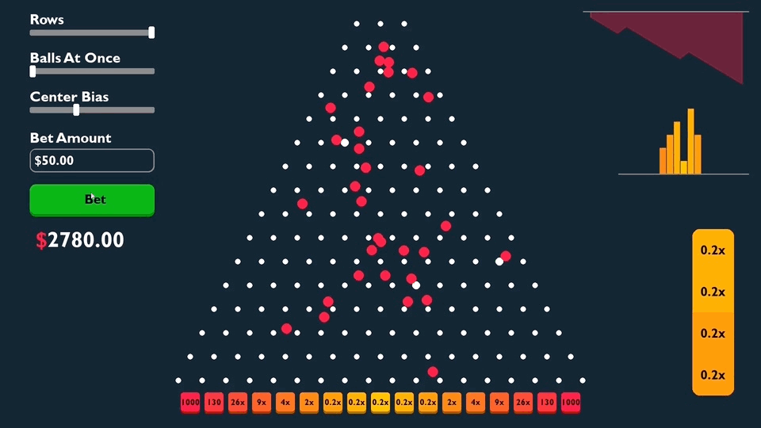

# Plinko-Balls
[YouTube Video](https://www.youtube.com/watch?v=E59LsTyOdmo)  
Pygame recreation of Stak'es Plinko gambling game. I built the game with the Pygame Python module to break down the functionality and mechanics of the game to possibly wrinkle the brains of you and fellow gamblers.

# Scripts
Main game: [plinko_balls.py](plinko_balls.py)  
Physics Demos: [demos](demos/)  
Different stages of game: [scripts](main%20scripts/)

# Physics & Mechanics
