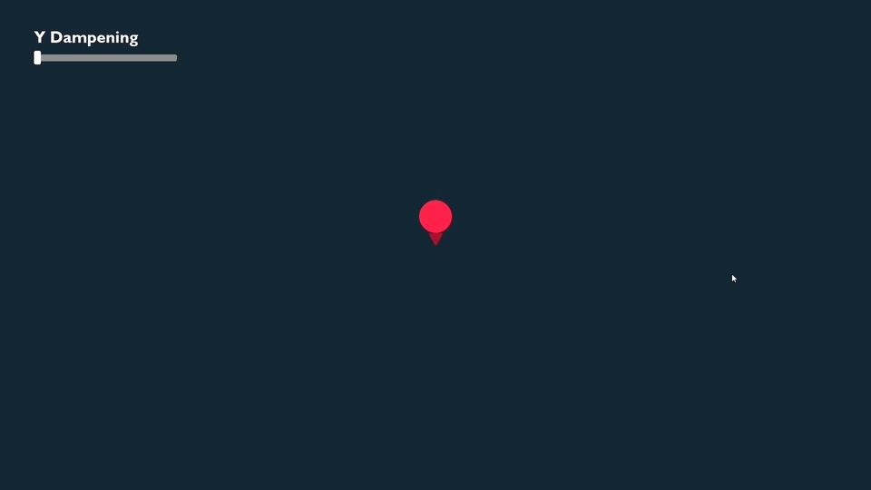

# Plinko-Balls
[YouTube Video](https://www.youtube.com/watch?v=E59LsTyOdmo)  
Pygame is a recreation of the Stak'es Plinko gambling game. I built the game with the Pygame Python module to break down the functionality and mechanics of the game and possibly wrinkle your and fellow gamblers' brains. The gambler drops balls in the hopes that they hit one of the high multipliers for a high return. The house, however, has set it up so that most of the balls go to the middle, and the gambler loses money.

# Scripts
Main game: [plinko_balls.py](plinko_balls.py)  
Physics Demos: [demos](demos/)  
Different stages of game: [scripts](main%20scripts/)

# Physics & Mechanics
Dampening in the y-direction does two things. It gives the ball gravity physics and it reduces the randomness of the path of the ball. The more the ball can bounce the more the ball can go where we don't want it to.

In addition, to dampen the ball's bounce due to gravity we can also do an additional dampen on the x-direction to get the ball to go more up than out. With the balls starting in the middle, ideally, we want the balls to go straight down from the house's perspective.

Now that the ball is more predictable we want to add bias in the x direction that the ball is not in the middle. We can do this by adding to the x-component of the ball's vector. We will add a small vector that points toward the middle, this way if the ball lands on the outside of a pin on the outside of the pyramid it will act like it hit the inside of the pin. 

